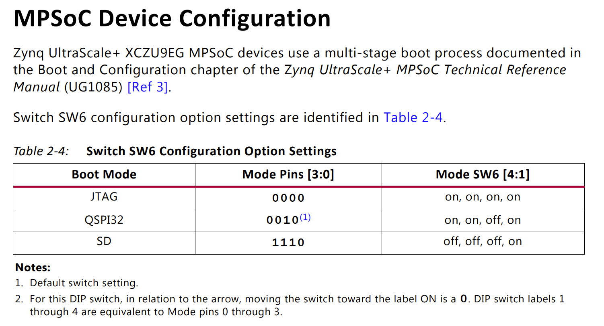
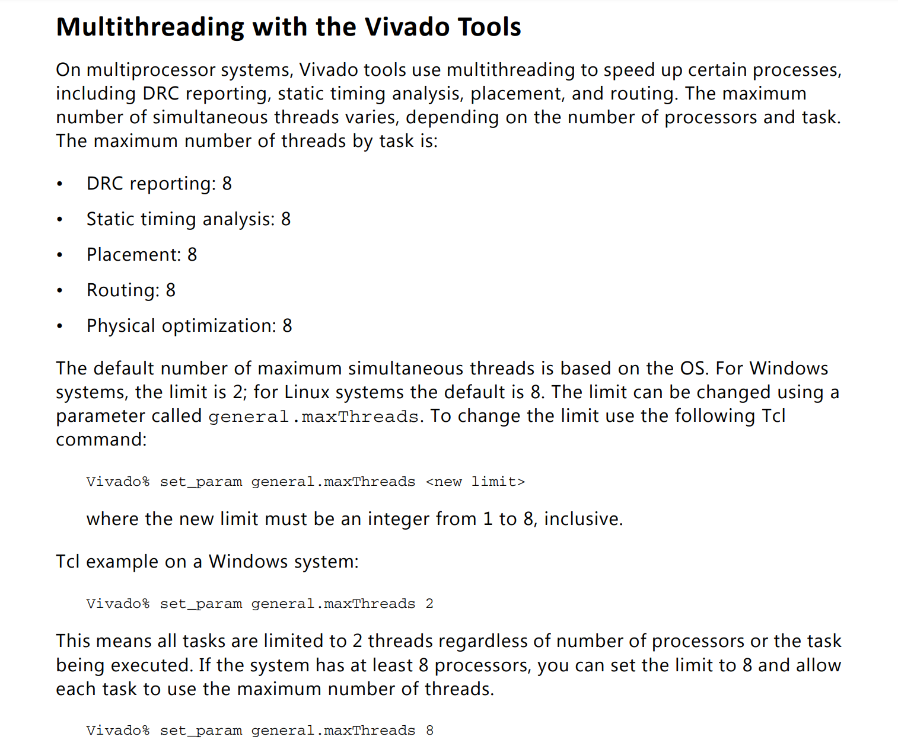

# 在 FPGA 上复现标签化 RISC-V 架构——踩坑指南

## 前言

本文主要记录总结笔者在 FPGA 上复现中科院计算所包云岗老师团队“[标签化 RISC-V 架构](http://sdc.ict.ac.cn/micro2018-tutorial/)”研究成果的过程中，遇到的诸多问题，以及相应的解决或规避方法。具体的复现步骤请参考这篇[部署指南](https://github.com/LvNA-system/labeled-RISC-V/blob/master/fpga/README.md)，本文的顺序将和该指南基本保持一致，以便于对照。尽管本文致力于解决问题，但由于笔者水平有限，不妥之处在所难免，欢迎读者批评指正。

特别感谢张传奇在复现过程中给予的大量及时而准确的帮助，他发现了许多问题的来源，并提供了解决思路和方案，这极大地缩短了笔者完成此过程所需的时间。

---

## 目录

<!-- @import "[TOC]" {cmd="toc" depthFrom=1 depthTo=6 orderedList=false} -->

<!-- code_chunk_output -->

- [在 FPGA 上复现标签化 RISC-V 架构——踩坑指南](#在-fpga-上复现标签化-risc-v-架构踩坑指南)
  - [前言](#前言)
  - [目录](#目录)
  - [硬件配置](#硬件配置)
    - [启动模式设置](#启动模式设置)
    - [风扇](#风扇)
  - [开发环境](#开发环境)
    - [系统](#系统)
    - [工具链](#工具链)
      - [Xilinx 的工具](#xilinx-的工具)
      - [交叉编译工具链](#交叉编译工具链)
  - [FPGA Bitstream](#fpga-bitstream)
  - [构建 RISC-V 镜像](#构建-risc-v-镜像)
    - [RISC-V Proxy Kernel](#risc-v-proxy-kernel)
    - [Device Tree](#device-tree)
    - [RISC-V rootfs](#risc-v-rootfs)
  - [准备 SD 卡](#准备-sd-卡)
    - [FSBL](#fsbl)
    - [Arm Trusted Firmware / BL31](#arm-trusted-firmware-bl31)
    - [BOOT.BIN](#bootbin)
    - [Device Tree](#device-tree-1)
  - [启动 ARM SoC](#启动-arm-soc)
  - [启动标签化 RISC-V 子系统](#启动标签化-risc-v-子系统)

<!-- /code_chunk_output -->

---

## 硬件配置

笔者使用的开发板是 [zcu102](https://www.xilinx.com/products/boards-and-kits/ek-u1-zcu102-g.html) ，搭载的 FPGA 型号为 Zynq UltraScale+ XCZU9EG-2FFVB1156 MPSoC。

### 启动模式设置

根据 [zcu102 用户指南](https://www.xilinx.com/support/documentation/boards_and_kits/zcu102/ug1182-zcu102-eval-bd.pdf)，FPGA 的启动模式配置方法如下：



注意其中SW6的顺序为**由 4 到 1** ，而非由 1 到 4 ，即如果希望从 SD 卡启动，应当**将 1 拨向 on ，其余拨向 off** 。很难相信这是笔者栽的第一个坑。

### 风扇

zcu102 搭载了一个直径仅约 30mm 的小风扇，电源直接接到 +12V ，测速线悬空，这导致其噪声较尖锐。可以考虑将其更换为转速更低、直径更大的风扇。**改装导致的硬件损坏的风险和后果由操作者自行承担**，笔者对此概不负责。 Xilinx Wiki 中提供了监测 [PS 温度及电压](https://xilinx-wiki.atlassian.net/wiki/spaces/A/pages/18842251/Zynq+UltraScale+MPSoC+-+PS+Temperature+and+Voltage+Monitor)和 [PL 温度及电压](https://xilinx-wiki.atlassian.net/wiki/spaces/A/pages/18842062/Zynq+UltraScale+Plus+MPSoC+-+PL+Temperature+and+Voltage+Monitor) 的方法，但笔者并未尝试，在此处列出仅供参考。

---

## 开发环境

### 系统

笔者使用 Windows + WSL + VMware。截止本文写作时，[将硬盘挂载到 WSL](https://docs.microsoft.com/en-us/windows/wsl/wsl2-mount-disk) 仍然是一个预览性的功能，故对于 SD 卡上 ext4 分区的操作仍然需要在一个非 WSL 的 Linux 虚拟机（或物理机）中完成。事实上，整个复现过程用到的代码和工具几乎全部需要（或可以）在 Linux 环境下运行（或编译），Windows 和 WSL 并不是必须的。笔者使用Windows是因为笔者的 Vivado 装在 Windows 上，而这个软件太庞大了，笔者甚至不想在 Windows 里更换一个版本，更别提在 Linux 里面再安装一遍了。

在 Windows 中使用 Git 克隆仓库，或解压源代码压缩包，可能导致代码的换行符变成 CRLF ，以及符号链接失效，进而在 WSL 中无法正常运行；尽管可以使用 dos2unix 软件解决换行符的问题，还是直接在 WSL或Linux 环境下准备代码来得更简单。

### 工具链

#### Xilinx 的工具

笔者使用的 Vivado 版本为2020.1，而仓库中的代码使用的版本有的是 2017.4 ，有的是 2019.1 ，生成 Vivado 项目时可能会报错。解决方法是将所有 tcl 文件中的 `set scripts_vivado_version` 后面的参数改成 2020.1 。

由于笔者在安装 Vivado 时并没有选择安装 Vitis ，后续在软件编译上遇到了一点麻烦，解决方法是去 [Xilinx 下载中心](https://www.xilinx.com/support/download/index.html/content/xilinx/en/downloadNav/embedded-design-tools/archive.html)下载安装 2019.1 版本的 Xilinx SDK 。选择这个版本主要是出于（和仓库代码的）兼容性考虑；此外，后续版本只能选择 PetaLinux ，而不能单独安装 SDK 了。下载时可能会要求提供个人信息以符合美国出口管制条例要求，填写时注意，国家/地区尽量保持与你访问下载中心所使用的 IP 地址所在地一致，姓名最好看起来像个真人，地址则可以在地图上随便抽个地点。

默认配置下，Vivado 可能会使用多个进程同时综合/实现，消耗大量的内存和 CPU 资源。根据 [Vivado 用户指南](https://www.xilinx.com/support/documentation/sw_manuals/xilinx2018_3/ug904-vivado-implementation.pdf)，可以通过设置 `general.maxThreads` 参数控制 Vivado 的线程数量上限，如下图所示：



#### 交叉编译工具链

XCZU9EG 中有四个 ARM Coterx-A53 核心，其运行的代码主要包括 FSBL、U-boot 和 Linux-xlnx 三部分，其中 FSBL 由 Xilinx SDK 中的工具链编译，而后两者则（可以）由用户自行配置的工具链编译。三者应使用相同或尽可能接近的工具链版本；Xilinx SDK 2019.1 中包含的 aarch64-gcc 版本为8.2.0，而 [ARM 官网提供的预编译交叉工具链](https://developer.arm.com/tools-and-software/open-source-software/developer-tools/gnu-toolchain/gnu-a/downloads)最早的版本为8.2.1，所幸最终编译出的程序可以正常运行。注意需要同时安装 **AArch64 ELF bare-metal target** 和 **AArch64 GNU/Linux target** 。

RISC-V 的工具链仍然需要遵循类似的版本一致原则，不过前述的[部署指南的 Preparations 章节](https://github.com/LvNA-system/labeled-RISC-V/tree/master/fpga#preparations)已经提供了一个预编译的 RISC-V 交叉工具链，可以直接下载使用。

如果你的系统中已经安装了其他版本的工具链，则需要考虑如何在编译过程中指定所用的工具链版本。一个可能的解决方案是，在添加环境变量时，将需要用到的工具链所在的文件夹放在PATH中靠前的位置，如：

```shell
export RISCV=~/toolchain/riscv-toolchain-2018.05.24
export AARCH64_ELF=~/toolchain/gcc-arm-8.2-2018.08-x86_64-aarch64-elf
export AARCH64_LINUX=~/toolchain/gcc-arm-8.2-2018.08-x86_64-aarch64-linux-gnu
export PATH=$RISCV/bin:$AARCH64_ELF/bin:$AARCH64_LINUX/bin:$PATH
```

---

## FPGA Bitstream

由于笔者的 Vivado 安装在 Windows 系统上，而其他编译在 WSL 中进行，因而 make 工具可能无法正确调用Vivado（或许可以在 Xilinx SDK/SCT 中执行 make 指令？），可以根据 [Makefile](https://github.com/LvNA-system/labeled-RISC-V/blob/master/fpga/Makefile#L18) 中的指令在 Windows 中手工调用 Vivado 来生成项目文件。

如果开发板选择的是 zedboard ，生成项目的过程中，可能会提示 Clocking Wizard IP 版本不兼容，找到 [prm.tcl](https://github.com/LvNA-system/labeled-RISC-V/blob/master/fpga/board/zedboard/bd/prm.tcl) ，将 `ip:clk_wiz` 从 5.4 改到 6.0 即可。不过笔者最终没能成功综合 zedboard 的代码，所以并不能确定这一方法是有效的。

时序分析可能会提示时间裕度不满足约束，但最终的 Bitstream 可以正常运行，所以忽略这个问题即可。

---

## 构建 RISC-V 镜像

### RISC-V Proxy Kernel

[riscv-pk/machine/minit.c 第 159 行](https://github.com/LvNA-system/riscv-pk/blob/master/machine/minit.c#L159)可能在编译器静态检查中报出访问越界的错误，可以修改成

```cpp
  extern char external_dtb[MAX_EXTERNAL_DTB_SIZE];
  uint32_t *p_external_dtb = (uint32_t *)external_dtb;
```

### Device Tree

dts 文件可以使用 [prm-sw 仓库中的 sidewinder.dts](https://github.com/LvNA-system/prm-sw/blob/master/misc/dtb/smp/sidewinder.dts#L171)  ，但是需要在 rom 部分后面添加如下内容，以确保 risc-v 部分可以正确连接到串口：

```c
serial@60000000 {
    compatible = "sifive,uart0";
    reg = <0x00 0x60000000 0x00 0x1000>;
    reg-names = "control";
};
```

### RISC-V rootfs

如果 Redis 测例编译不成功，则需要将 [initramfs.txt 中 Redis 部分](https://github.com/LvNA-system/riscv-rootfs/blob/master/rootfsimg/initramfs.txt#L53-L57)注释掉，以避免影响后续 RISC-V Linux 的编译。

---

## 准备 SD 卡

Arm Trusted Firmware、U-boot、device-tree-xlnx 和 Linux-xlnx 的 2019.1 版本分支都已经从相应的 Github 仓库中删除，但使用部署指南中提供的 Git 指令仍然可以正常克隆和切换。

### FSBL

[zcu102 更新了一次 DDR4 SODIMM](https://www.xilinx.com/support/answers/71961.html) ，需要在 FSBL 中开启动态 DDR 配置识别才能正确地初始化 DDR SODIMM ，[部署指南的 f6895ab 提交](https://github.com/LvNA-system/labeled-RISC-V/commit/f6895abf0a3d6c05fd1b87c9de21d251ffa43887)给出了具体的操作步骤，遵循即可，这里仅作提醒。

如果你希望在 FSBL 中输出更多的调试信息，需要在 fsbl_debug.h 中添加宏定义 `#define FSBL_DEBUG_INFO` ，或设法添加到编译器选项中。注意到编译器每次可能会从 SDK 文件夹中复制框架代码到项目文件夹中进行编译，你可能需要将这个定义添加到 **SDK 的代码文件中**，而非项目文件夹中的“临时”文件。更多信息见[这篇回答](https://forums.xilinx.com/t5/Embedded-Development-Tools/Printing-messages-from-fsbl/td-p/456226)和 [Zynq UltraScale+ MPSoC 软件开发指南](https://www.xilinx.com/support/documentation/user_guides/ug1137-zynq-ultrascale-mpsoc-swdev.pdf)。

### Arm Trusted Firmware / BL31

如果要启用调试，在执行 make 指令时可以加上 `DEBUG=1` 选项。此外，根据[这篇回答](https://www.xilinx.com/support/answers/71156.html)，由于开启调试后固件体积会膨胀，可能需要修改 ATF 的挂载地址（从 SRAM 更改到 DDR）才能正确启动；不过 Xilinx 提供的 ATF 已经[通过宏解决了这一问题](https://github.com/Xilinx/arm-trusted-firmware/blob/master/plat/xilinx/zynqmp/include/platform_def.h#L39)。尽管后来笔者没有用到 ATF 调试信息，但是在修改这个地址的过程中发现了前述的 DDR 模组初始化问题。

### BOOT.BIN

笔者没有成功在 FSBL 中烧写 Bitstream ，故不建议在 bif 文件中移除 .bit 文件所在行的注释。可以将 .bit 文件和 BOOT.BIN 放在 SD 卡的同一路径下，在 U-boot 阶段再进行烧写。

从 Vivado 2019.2 开始，HDF 格式的硬件描述文件被弃用，按照部署指南中的方法使用 Export Hardware 只能导出 XSA 格式的文件。根据[这篇回答](https://forums.xilinx.com/t5/Synthesis/Is-it-possible-to-generate-HDF-file-from-Vivado-2019-2/m-p/1170028/highlight/true#M36677)，可以通过在 Vivado 的 tcl 终端中输入 `write_hwdef -force -file <location>/filename.hdf` 来生成 hdf 格式的文件。

由于笔者的 Xilinx SDK 安装在 Windows 环境中，在 WSL 中无法执行 `make boootgen` 。可以在 Windows 中启动 XSCT ，将目录切换到 boot 文件夹，执行 `xsdk -batch -source mk.tcl <location>/system_top.hdf <project_name>` ；使用 xsdk 而非 hsi 的原因是，xsct 提示 hsi 不支持 `-source` 选项，不知道是版本还是平台问题。相应地，需要将 [mk.tcl](https://github.com/LvNA-system/labeled-RISC-V/blob/master/fpga/boot/mk.tcl) 中的所有 `open_hw_design` 、`generate_app` 、`set_repo_path` 、`create_sw_design` 、`set_property` 和`generate_target` 命令前面都加上 hsi 。此外，需要在 [mk.tcl 第47行](https://github.com/LvNA-system/labeled-RISC-V/blob/master/fpga/boot/mk.tcl#L47)加上 `-compile` 选项（参考第37行），否则只会生成代码而不会产生 ELF 文件。

虽然 Windows 中的 Xilinx SDK 带有 gnuwin ，可以执行 ln 命令，但似乎执行的不太好，一个简单粗暴的方案是把 mk.tcl 中的 `ln -sf` 全部换成 `cp -f` 。

### Device Tree

根据[这篇帖子](https://www.element14.com/community/thread/73139/l/ultrazed-ev-bootconsole-cdns0-disabled)，需要在 top.dts 的 bootargs 中加入 `console=ttyPS0,115200` ，指定 Linux 初始化完成之后继续使用 ttyPS0 作为 IO 终端。

---

## 启动 ARM SoC

将 zcu102 的 J83 连到电脑的 USB 上，可以看到四个串口设备，其中一个是连接到 ARM SoC 的，具体是哪个似乎比较随机，你需要看看哪个会输出 FSBL 的启动信息。串口波特率都是 115200 。

进入 U-boot 后，从串口随便发送什么内容终止自动启动，然后下载 Bitstream ，加载 Linux Image 和 DTB ，启动 Linux 。一次发送的指令不要太多，否则串口可能接收不全。参考 [Xilinx U-boot Wiki](https://xilinx-wiki.atlassian.net/wiki/spaces/A/pages/18842223/U-boot#U-boot-Bootapplicationimages) ，一种可能的命令序列如下：

```shell
u-boot> fatload mmc 0 0x400000 system_top.bit
u-boot> fpga loadb 0 0x400000 0x194862F
u-boot> fatload mmc 0 0x3000000 Image
u-boot> fatload mmc 0 0x2A00000 system.dtb
u-boot> booti 0x3000000 - 0x2A00000
```

其中 `0x2A00000` 、`0x3000000` 、`0x400000` 是内存地址，`0x194862F` 是 Bitstream 的字节数，可根据情况自行修改。booti 的第二个参数 '-' 表示没有使用 initrd 。

---

## 启动标签化 RISC-V 子系统

这一部分所用的代码和说明均由张传奇提供。

不必使用 prm-sw ，将[这个仓库](https://github.com/Gallium70/labeled-RISC-V-boot)中的代码复制到 ARM SoC 上，按照 README 操作即可。系统启动后，执行 /init-dsid.sh 初始化标签子系统，并会添加两个样例进程组 test-1 和 test-2 ，样例负载位于 /root 文件夹中。

```shell
mkdir -p /sys/fs/cgroup/dsid/$TASK_SET
echo $DSID > /sys/fs/cgroup/dsid/$TASK_SET/dsid.dsid-set
echo $PID > /sys/fs/cgroup/dsid/$TASK_SET/tasks
```

可建立起一个名为 `$TASK_SET` 的进程组，指定其 dsid 为 `$DSID` ，并将 `$PID` 对应的进程放入该进程组。借助 Cgroup 机制，一个进程的子进程也会被自动加入相同的进程组中。在设置好dsid号之后，可以对该进程组进行资源管控了，下面是使用方法的示例：

查看进程组信息：

```shell
cat /sys/fs/cgroup/dsid/$TASK_SET/dsid.dsid-cp
```

其中 l1_traffic 就是从 L1 到 L2 的数据流量，traffic 的单位是总线的一个 beat，大小是 64bit 。

设置 L2 掩码：

```shell
echo "l2_waymask 0xff" > /sys/fs/cgroup/dsid/$TASK_SET/dsid.dsid-cp
```

设置内存带宽控制的令牌桶参数：

```shell
echo "bucket_size 0x80" > /sys/fs/cgroup/dsid/$TASK_SET/dsid.dsid-cp
echo "bucket_freq 0x400" > /sys/fs/cgroup/dsid/$TASK_SET/dsid.dsid-cp
echo "bucket_inc 0x2" > /sys/fs/cgroup/dsid/$TASK_SET/dsid.dsid-cp
```
